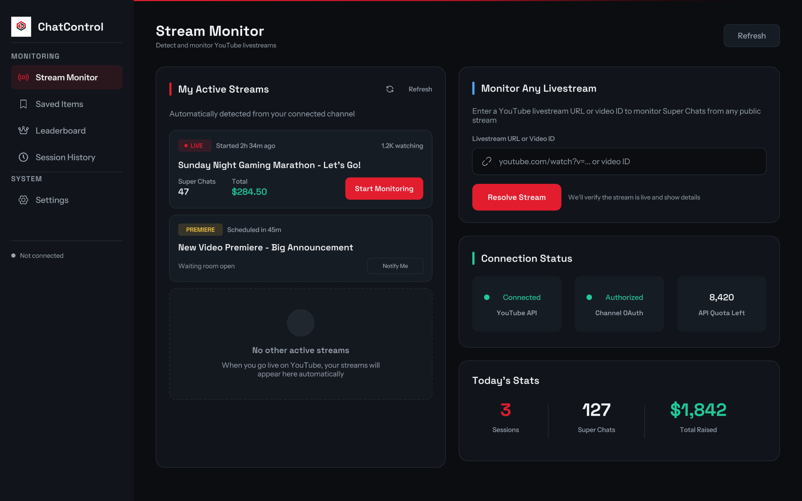
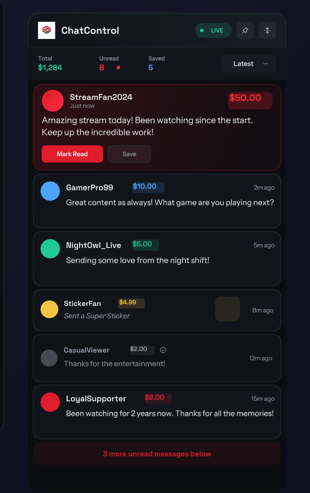
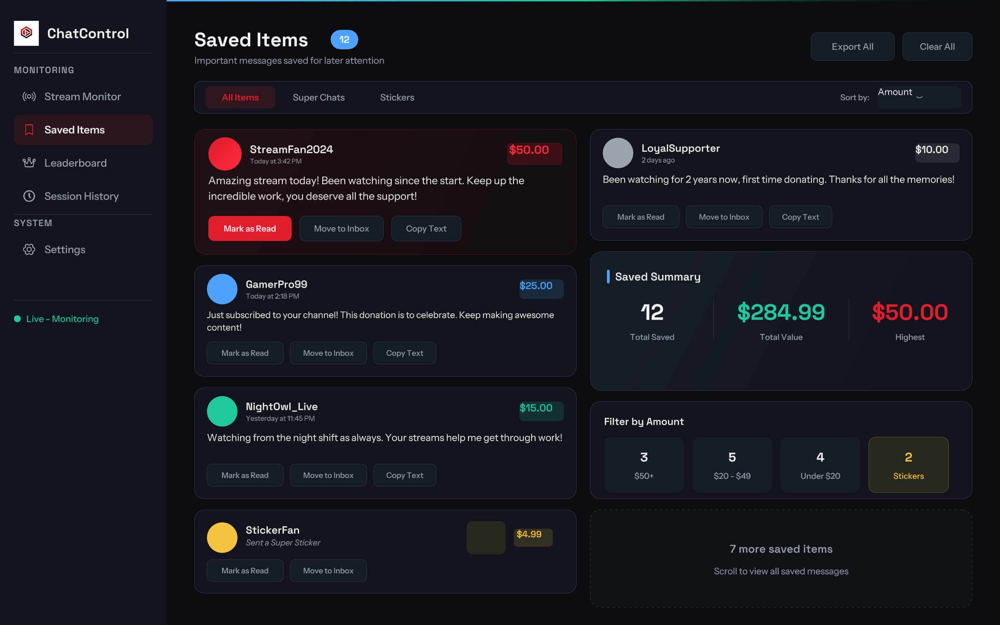
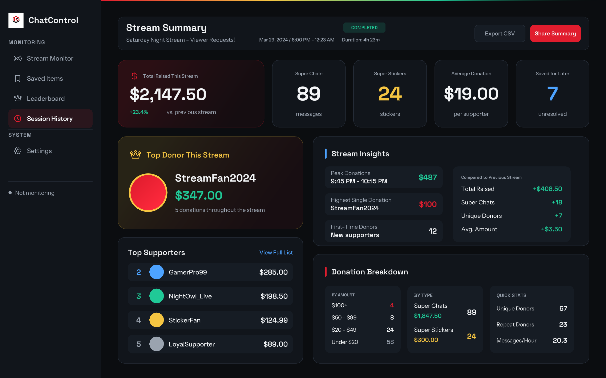

# ChatControl


ChatControl helps YouTube creators track paid live chat messages in a focused desktop inbox.

## App Preview / Screenshots


*Detect your own live stream or monitor any public livestream from a URL or video ID.*


*Keep an always-on-top overlay open while you sort, save, and clear paid messages.*


*Review saved messages later, copy text, and export your saved archive.*


*See past stream results with summaries, supporter insights, and export actions.*

## User-Facing Features

- Detect your own active YouTube livestream and start monitoring in a few clicks.
- Monitor any public live YouTube stream from a video URL or video ID.
- Show only paid messages, including Super Chats and Super Stickers.
- Use an always-on-top overlay with unread counts, saved counts, and sort controls.
- Mark messages as read, save them for later, undo quick actions, and clear unread items in bulk.
- Review saved items later, move them back to the inbox, copy message text, or export the archive.
- See top supporters for the current stream and across your local history.
- Browse session history with detailed stream summaries, CSV exports, and copied summaries you can share.
- Adjust currency, default sort, overlay lock, compact mode, opacity, and sound alerts.
- Keep your stream history and saved items stored locally on your device.

## Install / Getting Started

ChatControl does not currently publish public installers or GitHub releases from this repo. Right now, the app is run locally from the project.

1. Clone or download this repository to your computer.
2. Create a Google Cloud project, enable **YouTube Data API v3**, and create **OAuth 2.0 Desktop App** credentials.
3. Copy `.env.example` to `.env` and add your `GOOGLE_CLIENT_ID` and `GOOGLE_CLIENT_SECRET`.
4. Install dependencies with `npm install`.
5. Start the app with `npm run dev`.

### First Run

1. Open ChatControl and sign in with your YouTube account.
2. On **Stream Monitor**, click **Refresh** to find your active stream.
3. If you want to monitor another public livestream, paste its YouTube URL or video ID and click **Resolve Stream**.
4. Click **Start Monitoring**.
5. Open the overlay and begin marking messages as read or saving them for later.

## Developer Install / Local Setup

### Requirements

- Node.js 20 or newer
- npm
- macOS, Windows, or Linux for local desktop testing and packaging
- A Google Cloud project with **YouTube Data API v3** enabled
- OAuth desktop app credentials for Google sign-in

### Clone Or Download

```bash
git clone https://github.com/virajparmaj/chat-control.git
cd chat-control
```

If you already downloaded the project as a ZIP, extract it and open the project folder in your terminal.

### Configure Environment

```bash
cp .env.example .env
```

Add your credentials to `.env`:

```env
GOOGLE_CLIENT_ID=your-client-id.apps.googleusercontent.com
GOOGLE_CLIENT_SECRET=your-client-secret
```

### Install Dependencies

```bash
npm install
```

### Run In Development

```bash
npm run dev
```

### Build

```bash
npm run build
npm run build:unpack
npm run build:mac
npm run build:win
npm run build:linux
```

### Test And Verify

```bash
npm test
npm run typecheck
npm run lint
```

### Local Notes

- ChatControl needs `GOOGLE_CLIENT_ID` and `GOOGLE_CLIENT_SECRET` to enable sign-in.
- Packaged or runtime environments still need those credentials provided at launch time.
- Sign-in depends on Electron secure storage being available on the machine.
- The app stores local history, saved items, and auth data under Electron's app data directory.
